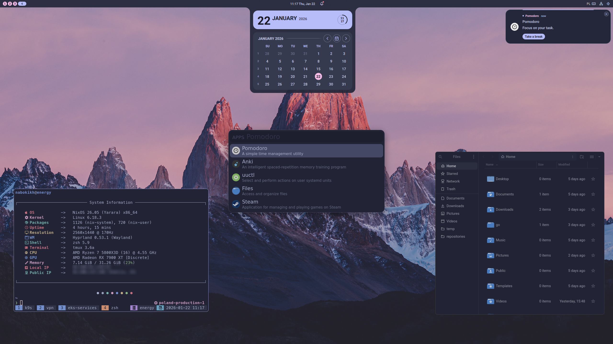

# Aaron's Nix Darwin Configuration

This repository is my personal macOS workstation configuration, built around
Nix flakes, nix-darwin, Home Manager, and Homebrew.

The main goal is not to make a perfectly pure Nix system. The goal is to keep a
real macOS development machine reproducible, recoverable, and pleasant to
operate, while still allowing pragmatic tools such as Homebrew casks, Conda,
npm, Cargo, custom scripts, and hand-maintained editor configs.

## Highlights

- **nix-darwin system configuration** for macOS defaults, users, PAM, keyboard
  behavior, Homebrew integration, and machine-level setup.
- **Home Manager user environment** for shell tools, terminal programs, Git,
  tmux, Neovim, scripts, themes, and user-level packages.
- **Controlled update workflow** with separate daily, controlled full, and
  native full update modes.
- **Homebrew protection list** for sensitive packages, currently protecting
  `emacs-plus-app@master` from routine updates.
- **Global command entrypoint** via `nix-darwin`, linked into `~/.local/bin` by
  Home Manager.
- **Pragmatic external config bootstrapping** for tools such as Emacs, Zsh, and
  Neovim.

## Screenshots

### macOS


### Linux desktop history

This repository still contains Linux desktop modules used by earlier or
secondary machines.



## Update Philosophy

Some tools can be updated casually. Some tools cannot.

My Emacs setup is hand-maintained and sensitive to upstream changes, so the
configuration treats Emacs-related updates as explicitly approved operations.
Routine updates should keep the machine fresh without unexpectedly replacing a
working editor setup during a busy day.

There are three main update levels:

```sh
nix-darwin daily
```

Daily maintenance. This rebuilds nix-darwin and Home Manager, runs controlled
Homebrew updates, and updates user-level tools such as npm, Cargo, and Conda.
Protected Homebrew packages are skipped.

```sh
nix-darwin controlled-full
```

A broader controlled update. This updates the approved flake inputs first, then
runs the daily update flow. Protected inputs such as `emacs-overlay` are not
updated here.

```sh
nix-darwin full
```

A native full update. This intentionally bypasses protection and runs native
Homebrew upgrades plus full flake updates. Use this when there is time to handle
breakage.

More details are documented in:

[docs/nix-darwin-update.md](./docs/nix-darwin-update.md)

## Homebrew And Emacs

Emacs is installed as a Homebrew cask:

```text
emacs-plus-app@master
```

The protected Homebrew lists live in:

```text
modules/darwin/common/brew/default.nix
```

The default protected cask list includes:

```nix
local.homebrew.protectedCasks = [
  "emacs-plus-app@master"
];
```

Routine controlled updates skip protected formulae and casks. Protected items
can still be updated explicitly:

```sh
nix-darwin brew-update-protected
```

or with the Emacs-oriented alias:

```sh
nix-darwin brew-update-emacs
```

## Global Command

Home Manager exposes this repository through a global helper command:

```sh
nix-darwin
```

The script lives at:

```text
modules/home-manager/scripts/bin/nix-darwin
```

It defaults to using this repository at:

```sh
~/.nixpkgs
```

If the repository moves, set:

```sh
export NIX_DARWIN_CONFIG=/path/to/config
```

Examples:

```sh
nix-darwin help
nix-darwin daily
nix-darwin controlled-full
nix-darwin full
```

## Repository Layout

```text
flake.nix          Flake inputs and outputs
flake.lock         Locked dependency graph
Makefile           Local command orchestration
hosts/             Host-specific system entrypoints
home/              User and host Home Manager entrypoints
modules/darwin/    nix-darwin modules for macOS
modules/home-manager/
                   Home Manager modules and user scripts
modules/nixos/     Linux system modules kept in the repo
overlays/          Custom package overlays
files/             Static assets, screenshots, avatar, wallpaper
docs/              Project documentation
```

## Main Components

- **Nix flakes** pin system inputs and expose macOS, NixOS, and Home Manager
  configurations.
- **nix-darwin** manages macOS system settings and Homebrew integration.
- **Home Manager** manages the user environment and links custom scripts into
  `~/.local/bin`.
- **Homebrew** remains the source of truth for macOS GUI apps and some CLI tools.
- **Custom scripts** provide practical commands for daily operations, project
  navigation, OCR, Emacs integration, and system updates.

## Common Commands

```sh
make darwin-rebuild
make home-manager-switch
make daily-update
make controlled-full-update
make full-update
```

The preferred external interface is:

```sh
nix-darwin daily
```

## Notes

This is a personal workstation configuration. It contains assumptions about my
username, machine names, Homebrew prefix, editor setup, and local workflow.

It can be used as a reference for structuring a pragmatic nix-darwin setup, but
it is not intended to be a drop-in distribution for other machines.

## License

MIT. See [LICENSE](./LICENSE).
